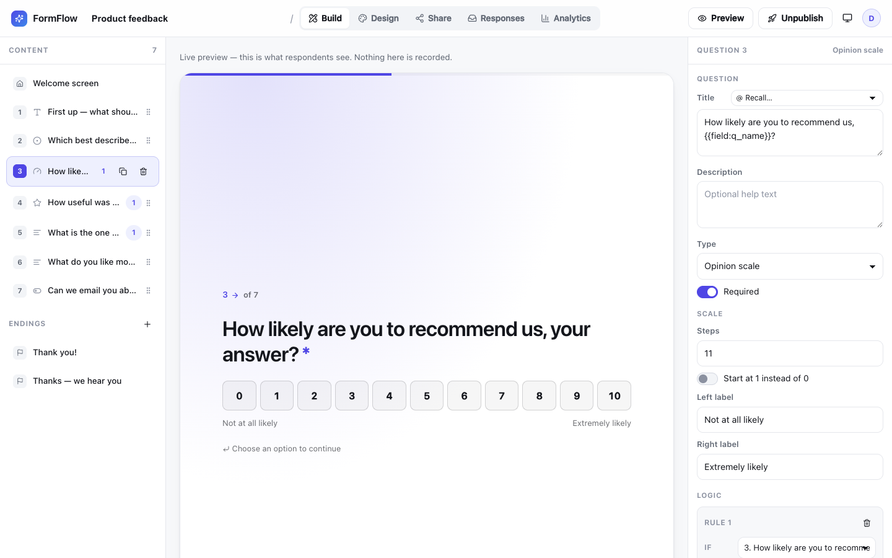
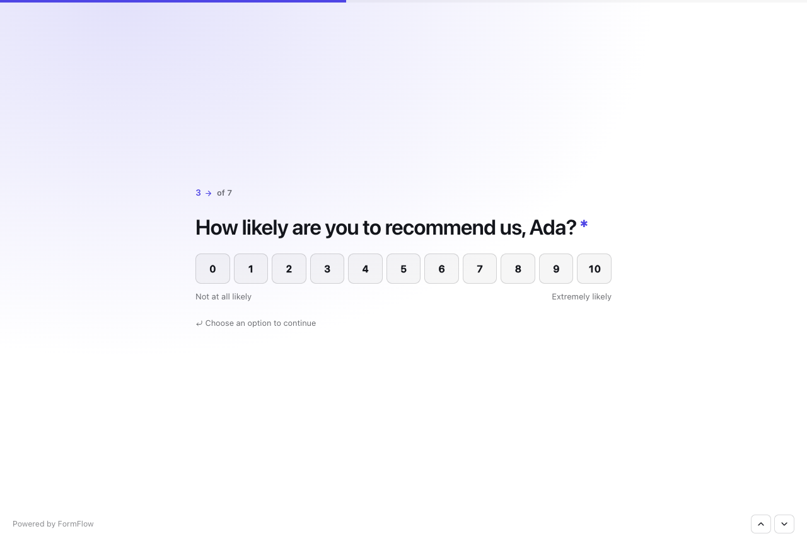
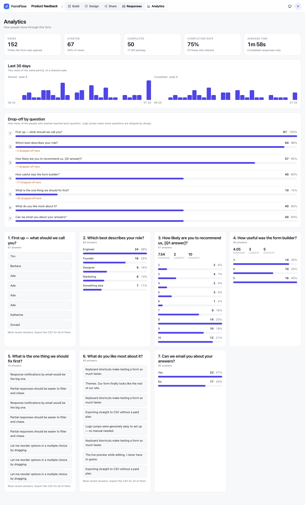
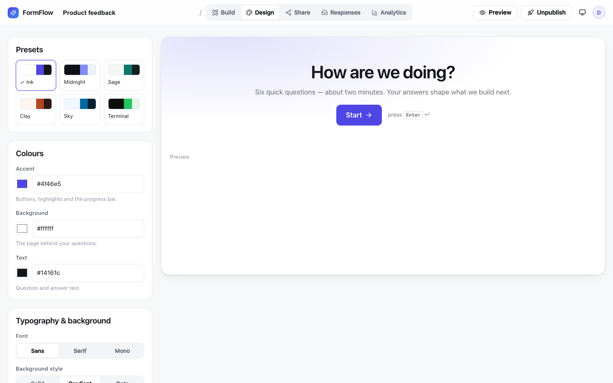
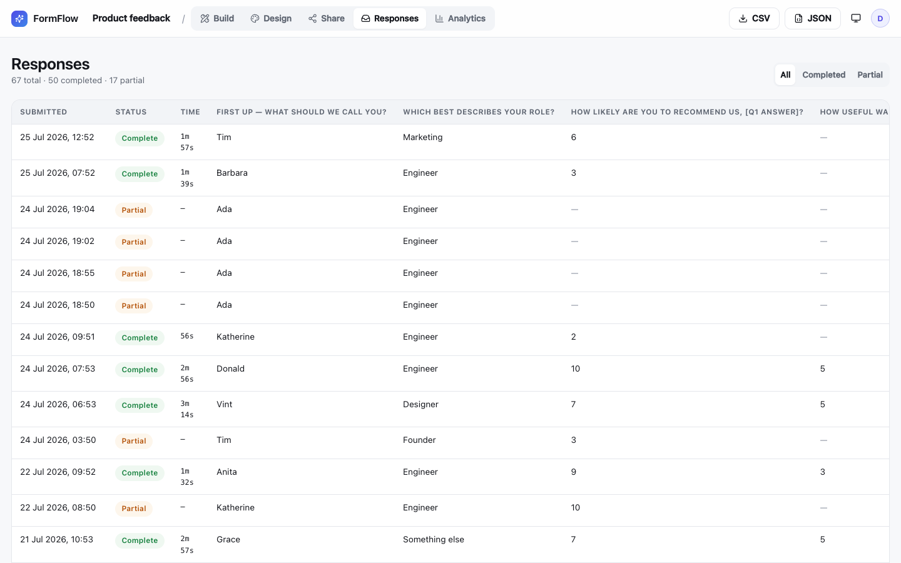
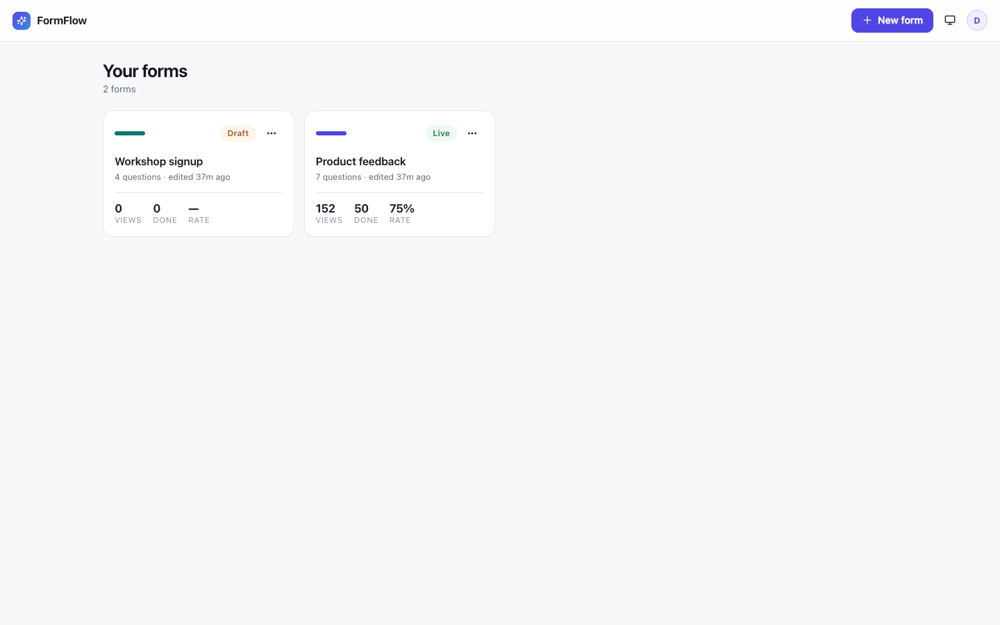

# FormFlow

**A self-hosted conversational form and survey builder — one full-screen
question at a time, so people actually reach the end.**

Build a form by dragging questions into place, branch people down different
paths with conditional logic, theme it to match your brand, then share a link or
embed it. Responses, completion rates and per-question drop-off land in your own
dashboard.

Everything lives in a single SQLite file inside a Docker volume you control. No
third-party account, no per-response pricing, no data leaving your server.



| The respondent's view — one question at a time | Analytics — completion rate and drop-off |
| --- | --- |
|  |  |
| **Design — themes, fonts and backgrounds** | **Responses — a row per submission, exportable** |
|  |  |

## Why it exists

A form that shows twenty fields at once tells the person filling it in exactly
how much of their evening it is going to cost, and a good proportion of them
close the tab there and then. Asking one question at a time hides the length and
keeps the momentum, which is why the commercial tools all work that way.

Those tools also price per response, keep your data on their infrastructure, and
turn "who can see the results" into a billing tier. For anything with real
answers in it — staff feedback, incident reports, anything a governance team
would want a view on — that is the wrong trade.

FormFlow is the same interaction model, running on your own hardware, with the
access rules that internal use actually needs: invite-only accounts, forms owned
by teams rather than individuals, and anonymous forms that are genuinely
anonymous.

## What it does

- **One question at a time** — a full-screen, keyboard-driven flow with smooth
  transitions. `Enter` continues, `A`/`B`/`C` pick a choice, `Y`/`N` answer
  yes-no, and the arrows in the corner move back and forth.
- **14 question types** — short and long text, email, phone, number, website,
  multiple choice (single or multi-select), dropdown, yes/no, star rating,
  opinion scale, date, file upload, and statement screens.
- **Conditional logic** — per-question rules that jump to another question or
  straight to an ending. Rules can test *any earlier* answer, not just the
  current one, and run in order so the first match wins.
- **Answer recall** — quote an earlier answer inside a later question:
  *"How likely are you to recommend us, Ada?"*
- **Themes** — six presets plus your own accent, background and text colours,
  three font families, and solid, gradient or dotted backgrounds.
- **Multiple endings** — send happy and unhappy respondents to different closing
  screens, each with an optional call-to-action button or automatic redirect.
- **Welcome screens**, progress bar and question numbering, all optional.
- **Live preview while you build** — the middle pane *is* the real form,
  rendered by the same code respondents get. Nothing is recorded.
- **Analytics** — views, starts, completions, completion rate, average time to
  complete, a 30-day trend, drop-off per question, and aggregates for every
  question (option counts, averages and distributions, recent free-text answers).
- **Responses** — a sortable table, a detail view per response, partial-response
  tracking, and one-click **CSV** or **JSON** export.
- **File uploads** — respondents attach files, you download them from the
  responses table. Size and type limits are yours to set.
- **Invite-only accounts** — nobody can sign themselves up. Administrators issue
  single-use invitations bound to one email address.
- **Groups** — forms belong to a team, not a person. Members are managers,
  editors or viewers, and a form's results can be shared across groups.
- **Internal by default** — a form requires a sign-in unless a manager
  deliberately opens it to anyone with the link, and open forms stay genuinely
  anonymous.
- **Embeddable** — copy an `<iframe>` snippet from the Share tab and drop the
  form into any page.
- **Light and dark**, following the system theme or pinned.
- **Responsive** — the builder works down to a tablet; the form itself is built
  for phones first.



## Run it

### With Docker (recommended)

```bash
docker compose up -d
```

Open **<http://localhost:8080>** and register. On a fresh instance the first
account created becomes the administrator, and everyone else joins by
invitation — so claim that account before sharing the address.

The image is published to GitHub Container Registry on every push to `main`, for
both `amd64` and `arm64`.

To change the port, pin an image tag, or adjust upload and rate limits, copy the
environment template first:

```bash
cp .env.example .env    # edit as needed
docker compose up -d
```

To build from source instead of pulling, uncomment the `build:` block in
[`compose.yaml`](compose.yaml) and run `docker compose up -d --build`.

### From source

Needs **Node 24 or newer** — FormFlow uses Node's built-in `node:sqlite`, so
there is no native module to compile.

```bash
npm install
npm run dev
```

This starts the Vite dev server with hot reload on <http://localhost:5173> and
the API on 8080, which Vite proxies to. Open the 5173 address. Data goes to
`./data/` (gitignored) rather than a Docker volume.

| Script | What it does |
| --- | --- |
| `npm run dev` | Vite + API together, with reload on both |
| `npm run build` | Type-check and build the production bundle into `dist/` |
| `npm start` | Serve `dist/` and the API from one Node process |
| `npm run preview` | Preview the built bundle with Vite's static server |
| `npm run set-password` | Break-glass password reset (see [Accounts](#accounts-groups-and-access)) |

Or run the dev environment in a container, with no local Node at all:

```bash
docker compose --profile dev up dev     # -> http://localhost:5173
```

## Configuration

Every setting has a sensible default, so an unconfigured container still runs
correctly. See [`.env.example`](.env.example) for the annotated version.

| Variable | Default | What it does |
| --- | --- | --- |
| `PORT` | `8080` | Port the server listens on |
| `FORMFLOW_DATA_DIR` | `/data` (Docker), `./data` (dev) | Where `formflow.db` and `uploads/` live |
| `FORMFLOW_MAX_UPLOAD_MB` | `10` | Largest file a respondent may attach |
| `FORMFLOW_RATE_LIMIT` | `120` | Public write requests per IP per minute |
| `FORMFLOW_SESSION_TTL_DAYS` | `30` | How long a sign-in lasts |
| `FORMFLOW_INVITE_TTL_DAYS` | `7` | How long an invitation stays redeemable |
| `FORMFLOW_SECURE_COOKIES` | `false` | Force the `Secure` cookie flag (see [Security](#security)) |
| `FORMFLOW_TRUST_PROXY` | `true` | Trust `X-Forwarded-*` for client IP and scheme |

Everything else — themes, question logic, who may fill a form in — is edited in
the app itself, not in environment variables.

## How it's built

```
server/                Node + Express API, no build step
  db.mjs               node:sqlite connection, schema migrations, ids
  auth.mjs             scrypt password hashing, DB-backed sessions
  permissions.mjs      roles, group membership, form access — every check
  invites.mjs          single-use, email-bound invitations
  audit.mjs            append-only log of access changes
  model.mjs            form document <-> tables, answer flattening
  routes/auth.mjs      register (invite-gated), login, logout, self-service
  routes/admin.mjs     accounts, invitations, audit log — administrators only
  routes/groups.mjs    groups and their membership
  routes/forms.mjs     forms, responses, export, analytics, files, sharing
  routes/public.mjs    respondent API: read form, save answers, upload, submit
  set-password.mjs     break-glass password reset from the command line
  index.mjs            app wiring, security headers, static bundle, SPA fallback

src/                   React + TypeScript front end
  lib/                 types, API client, logic engine, validation, theming
  components/          shared UI, the form runner, chart primitives
  components/builder/  question rail, inspector, logic editor, design, share
  pages/               auth, dashboard, builder, results, analytics, fill
                       plus admin, groups and account
```

A few decisions worth knowing about:

- **One runtime process.** In production a single Node process serves both the
  API and the built React bundle, with a SPA fallback so deep links work.
- **`node:sqlite`, not a driver.** SQLite ships with Node 24, so the runtime
  image needs no compiler and no native rebuild when Node updates. WAL mode is
  on, because every public form view writes an analytics row.
- **Sessions, not JWTs.** Session tokens are random and stored in the database,
  so signing out actually revokes access.
- **The whole form saves at once.** The builder autosaves the entire document
  as one transaction. Field ids survive saves, so logic rules and collected
  answers keep pointing at the same question.
- **Answers save as you go.** Each answer is written when the respondent moves
  on, which is what makes partial responses and drop-off analytics possible.
- **Response ids are capabilities.** A response id is 24 random characters,
  given only to the browser that started it, and it stops accepting writes once
  submitted. A response started while signed in is bound to that account, so a
  leaked id cannot be used to answer in someone else's name.
- **One place decides access.** Every permission check funnels through
  `formAccess()` in `permissions.mjs`, so route handlers never assemble their
  own rules. Routes answer `404` rather than `403` when you have no access at
  all, so the API never confirms an id exists to someone who cannot see it.
- **Forms outlive people.** A form belongs to a group, so deleting the account
  that created it leaves the form and its responses with the group.

## Accounts, groups and access

FormFlow is **invite-only**. Registration is closed to anyone without an
invitation, with exactly one exception: on a brand-new instance with no accounts
at all, the first person to register becomes the administrator.

### Roles

Two independent axes. Someone's system role says what they can do to the
*instance*; their group role says what they can do to a *team's forms*.

| System role | |
| --- | --- |
| **Administrator** | Runs the instance: accounts, invitations, every group and every form. |
| **Member** | Sees only what their groups give them. |

| Group role | |
| --- | --- |
| **Manager** | Adds and removes members, and fully controls the group's forms — including deleting them, moving them and changing who may fill them in. |
| **Editor** | Creates and edits the group's forms, and reads their results. |
| **Viewer** | Reads results only. The builder opens read-only. |

### Groups and sharing

Every form belongs to exactly one group, which owns it and its responses. A form
can additionally be shared with other groups as **can view results** or **can
edit the form**.

A share never grants more than the recipient's own role allows: someone who is a
viewer in their group still only views, even where the share says "can edit".
Nor does a share ever confer *manage* — only the owning group can delete a form
or re-share it.

### Inviting people

Administrators create invitations in **Admin → Invitations**. There is no mail
server: you copy the link and send it however your organisation already
communicates. An invitation works **once**, only for the **address it was issued
to**, and expires after `FORMFLOW_INVITE_TTL_DAYS` (7 by default). Forwarding
the link to someone else is useless.

### Who can fill a form in

Each form chooses, in its **Share** tab:

- **Signed-in people only** (the default) — anyone with an account on the
  instance can respond, and each response records **who** sent it.
- **Anyone with the link** — no sign-in, and responses are **anonymous**. No
  identity is recorded even for respondents who happen to be signed in, so
  "anonymous feedback" means what it says.

Only a group manager can change this setting or publish a form to the world.

### Audit log

**Admin → Activity** records account, group, membership and sharing changes plus
sign-ins. Form edits and responses are deliberately not logged — they are
already visible in the product, and logging them would bury the entries that
matter.

## Security

- Passwords use **scrypt** from `node:crypto` — memory-hard, and no bcrypt build
  step.
- Sessions are **random tokens stored in the database**, in an httpOnly,
  `SameSite=Lax` cookie. Signing out revokes access immediately.
- State-changing API requests additionally require the browser-set `Origin` to
  match the host.
- Public form pages (`/f/...`) deliberately allow framing so embeds work. Every
  other route is `SAMEORIGIN`.
- Session cookies are marked `Secure` automatically when the request arrives
  over HTTPS, which works as long as your proxy sets `X-Forwarded-Proto`. If it
  does not, set `FORMFLOW_SECURE_COOKIES=true` and make sure the app is never
  reachable over plain HTTP — otherwise sign-in will silently fail.

### If you get locked out

An administrator resets other people's passwords from **Admin → People**. For
the last administrator locking *themselves* out, there is a break-glass reset
that runs on the machine holding the database:

```bash
npm run set-password -- someone@example.com 'a new passphrase' --admin
```

It revokes every existing session for the account and records itself in the
audit log. Shell access to the data directory is the authority — anyone who has
it could rewrite the hash by hand anyway.

There is deliberately no self-service password reset flow, because there is no
mail server to send one.

## Backing up

Everything is in the volume: `formflow.db` (plus its `-wal` and `-shm`
companions) and the `uploads/` directory. The simplest safe backup is to stop
the container and copy the directory:

```bash
docker compose stop web
docker run --rm -v formflow_formflow-data:/data -v "$PWD:/backup" alpine \
  tar czf /backup/formflow-backup.tar.gz -C /data .
docker compose start web
```

To keep the data somewhere you can back up directly, swap the named volume in
`compose.yaml` for a host path such as `./data:/data` — that directory must be
writable by uid 1000.

## Licence

MIT — see [LICENSE](LICENSE).
